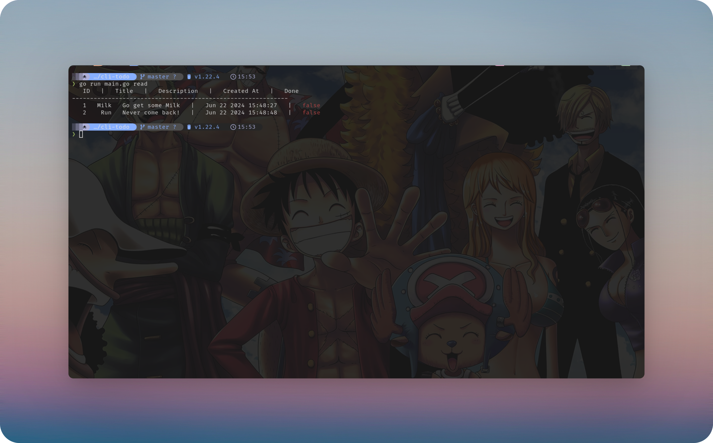

# Todoify - A TODO CLI TOOL

A simple command-line Todo application written in Go. This CLI allows you to add, read, update, and delete Todo items. Written for learning purposes.

## Features

- Add new Todo items with title and description.
- Read all Todo items.
- Delete a specific Todo item by ID.
- Update a specific Todo item by ID.



## Installation

1. Ensure you have Go installed on your machine. You can download and install Go from [golang.org](https://golang.org/).

2. Install the `todoify` using `go install`:

   ```bash
   go install github.com/ankitdev10/todoify@latest
   ```

3. Ensure that your `$GOPATH/bin` is added to your `$PATH` environment variable. This allows you to run the `todo` command from anywhere.

## Basics

## Help

```bash
todoify help

```

For specific commands

```bash
todoify help add
```

## Usage

### Add a new Todo

To add a new Todo item, use the `add` command with `--title` and `--description` flags:

```bash
todoify add -t "My new todo" -d "This is the description of my new todo"
```

### Get all Todos

To list all Todo items, use the `read` command:

```bash
todoify read
```

### Delete Todo with a ID

To delete a specific Todo item by its ID, use the `delete` command with `--id` flag:

```bash
todoify delete -i 1
```

### Update Todo with a ID

To update a specific Todo item by its ID, use the update command with `--id`, `--title`, `--description`, and `--done` flags:

```bash
todoify update -i 1 -t "Updated title" -d "Updated description" -o true
```

You can only update one section using respective flags as well
For example to change the `Done` state.

```bash
todoify update -i 1 -o true
```
